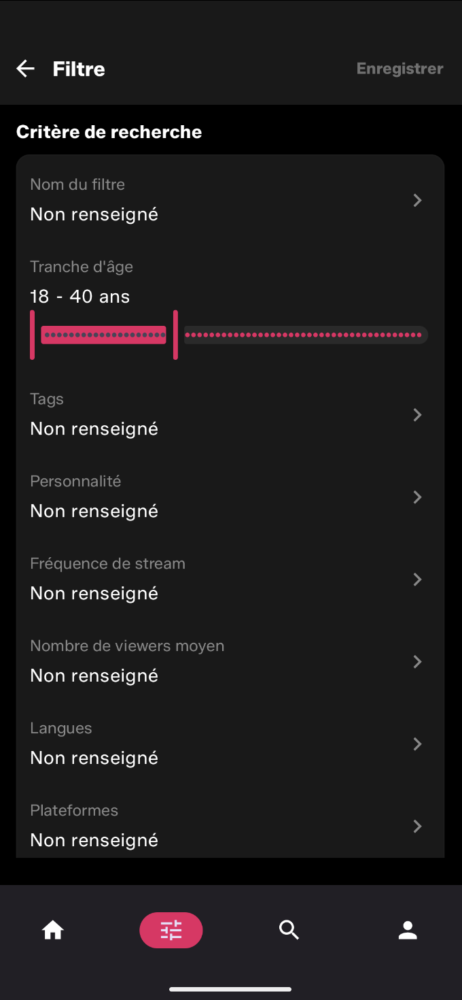
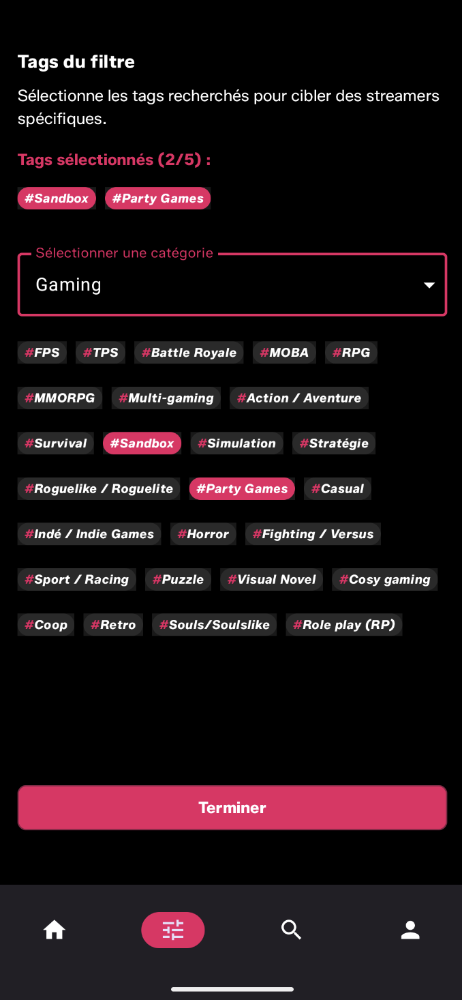

<p align="right">
  <a href="README.md"></a>
  <a href="README.en.md"></a>
</p>

# Strimup — Android Native

> **Discover and connect with content creators who match your interests.**
> The 100% native Kotlin/Compose port of the [strimup.com](https://www.strimup.com) web platform.

<p align="left">
  
  
  
  
  
  
  
  
  
</p>

---

## App preview

<p align="center">
  
  
  
</p>

## Table of Contents

- [About & Project Origin](#about)
- [Architecture & Design Patterns](#architecture)
- [Tech Stack & Libraries](#tech-stack)
- [Key Features](#features)
- [Best Practices & Code Quality](#best-practices)
- [Project Structure](#structure)
- [Installation & Setup](#installation)
- [Roadmap](#roadmap)
- [Author](#author)

---

<a id="about"></a>
## About & Project Origin

**Strimup** is a platform connecting **streamers** and **communities**, designed to help content creators gain visibility and to let viewers discover new talent through a **multi-criteria filtering** system (category, language, platform, age range, tags, live status, etc.).

The project started out as a **full web application** ([www.strimup.com](https://www.strimup.com)) that I developed and deployed full-stack. Given the massive shift toward mobile usage, and my own desire to specialize in the **native Android** ecosystem, I undertook a **full port to Kotlin / Jetpack Compose**, reusing the same backend (REST API) but with an architecture rebuilt **from scratch** according to mobile industry standards.

This repository is therefore not a simple academic exercise: it is a **real production application**, backed by a live production backend, with two goals here:

1. Provide Strimup users with a smooth, fast mobile experience.
2. Demonstrate my ability to design a robust, testable, and maintainable Android application — clean architecture, strict separation of concerns, rigorous state management...

---
<a id="architecture"></a>
## Architecture & Design Patterns

The application follows **Clean Architecture** principles, split into three independent layers per feature, promoting decoupling, testability, and scalability.

```
┌───────────────────────────────────────────────┐
│                 Presentation                  │
│   Composables · ViewModel · UiState · UiEvent │
└───────────────────────▲───────────────────────┘
                        │ exposes (StateFlow / Channel)
┌───────────────────────┴───────────────────────┐
│                     Domain                    │
│   UseCases · Entities · Repository (interface)│
└───────────────────────▲───────────────────────┘
                        │ implements
┌───────────────────────┴───────────────────────┐
│                     Data                      │
│ Repository (impl) · Retrofit API · Room · DTO │
└───────────────────────────────────────────────┘
```

- **`data/`** — Repository implementations, Retrofit services, Room DAOs, DTOs, and mappers (DTO → domain entity).
- **`domain/`** — Business core, independent of the Android framework: entities, repository interfaces, and **UseCases** (a single responsibility per use case: `CreateFilterUsecase`, `GetStreamersByFilterUsecase`, `GetUserFlowUseCase`…).
- **`presentation/`** — ViewModels, UI states, and Compose screens. No business logic flows through here: the ViewModel orchestrates UseCases and exposes immutable state.

The project is split into functional modules within a single `app` module, organized into **`core/`** (cross-cutting building blocks: auth, user, streamer, tag, network, database) and **`feature/`** (business screens: `home`, `search`, `filter`, `streamerdetail`, `streamerprofile`, `auth`), each exposing its own Hilt injection module.

### MVVM / MVI & state management

- **Unidirectional state (UDF)**: the `ViewModel` holds a single private `MutableStateFlow<UiState>`, exposed read-only via `StateFlow`. The Compose UI only observes and renders that state — never the reverse.
- **States modeled as `sealed interface`**: each screen defines its own exhaustive state contract, letting the Kotlin compiler guarantee that no case (`Loading`, `Success`, `Error`) is missed in the Composable's `when`.

  ```kotlin
  sealed interface MatchedStreamersUiState {
      data object Loading : MatchedStreamersUiState

      data class Success(
          val filterName: String? = null,
          val matchedResult: StreamerMatchResult,
          val originalMatchedResult: StreamerMatchResult,
          val isLiveOnly: Boolean = false,
          val isLoadingNextPage: Boolean = false,
      ) : MatchedStreamersUiState

      data class Error(val errorMessage: String) : MatchedStreamersUiState
  }
  ```

- **One-off events (`UiEvent`)**: single-use effects (showing a `Snackbar`, navigating, triggering a one-time action) flow through a dedicated `sealed interface UiEvent`, kept separate from persistent state — avoiding event replay on recomposition or configuration change.

  ```kotlin
  sealed interface FilterListUiEvent {
      data class ShowSnackBar(val text: String) : FilterListUiEvent
  }
  ```

### Dependency Injection — Hilt

Each `feature` and each `core` module exposes its own **Hilt module** (`@Module @InstallIn(SingletonComponent::class)`), binding `domain` interfaces to their `data` implementations (`FilterModule`, `HomeModule`, `AuthModule`, `StreamerCoreModule`, `TagModule`…). `ViewModel`s are injected via `@HiltViewModel`, ensuring loose coupling and maximum testability (mocking dependencies by interface).

---
<a id="tech-stack"></a>
## Tech Stack & Libraries

| Domain | Technologies |
|---|---|
| **UI** | [Jetpack Compose](https://developer.android.com/jetpack/compose) · Material 3 · [Navigation 3](https://developer.android.com/guide/navigation/navigation-3) · Coil 3 (image loading) |
| **Async** | Kotlin Coroutines · `Flow` / `StateFlow` |
| **Networking** | Retrofit 2 · OkHttp (+ `logging-interceptor`, custom `Authenticator`/`Interceptor` for token refresh) · Kotlinx Serialization |
| **Persistence** | Room 3 · DataStore Preferences (user session) |
| **Architecture** | AndroidX ViewModel & Lifecycle · Clean Architecture · UseCases |
| **Dependency Injection** | Hilt / Dagger |
| **Build** | Gradle Kotlin DSL · Version Catalog (`libs.versions.toml`) · KSP |

**Language & tooling**

- **Kotlin 2.3**.
- **KSP** for Room and Hilt code generation.
- **Kotlinx Serialization** for JSON (de)serialization.

---
<a id="features"></a>
## Key Features

### Advanced multi-criteria filters
Creation of custom search filters (category, language, platform, age range via an `AgeRangePicker`, tags…), saved and manageable from a dedicated list with **optimistic deletion** (immediate UI update, silent rollback on network failure).

### Streamer discovery & matching
Results screen (`MatchedStreamersScreen`) displaying streamers matching a filter, with **pagination**, **live filtering** ("live only" toggle), and real-time live status display.

### Streamer profile management & editing
Dynamic profile editing (avatar, bio, social networks, tags) via modular components (`BottomSheet`, tag pickers) and dedicated `UseCase`s (`UpdateProfileUsecase`, `UpdateAvatarUsecase`).

### Tags & categories
Selection of tags organized by category (`TagEntity(id, name, category)`) to refine both search filters and a streamer's profile.

### Authentication
Login / sign-up with session management via **DataStore**, automatic token refresh through a dedicated OkHttp `Authenticator`, and social network login.

### Home & search
Discovery feeds (favorites / non-favorites), streamer search, navigation to a profile's detail screen.

---
<a id="best-practices"></a>
## Best Practices & Code Quality

- **State immutability**: `UiState`s are immutable `data class` / `sealed interface` types; every update goes through `copy()`, never direct mutation — guaranteeing predictable data flow (UDF).
- **End-to-end `Result<T>`**: `UseCase`s and `Repository`s return Kotlin `Result<T>` rather than throwing unchecked exceptions, enforcing explicit success/failure handling (`onSuccess` / `onFailure`) all the way to the ViewModel.
- **Interface-oriented repositories**: each feature exposes a `Repository` interface in `domain/`, implemented in `data/` — enabling full mocking in unit tests without any dependency on Retrofit/Room.
- **Decoupled, reusable Compose components**: systematic extraction into small components (`FilterBadge`, `FilterItemCard`, `FavoriteIconButton`, `EditProfileImageSection`…) with **`@Preview`** for fast visual iteration, independent of running on a device/emulator.
- **Responsive UI**: layouts built with Compose primitives (`Column`, `Row`, `LazyColumn`, `BoxWithConstraints`) with no hardcoded dimensions, adapting to different screen sizes.
- **Strict layer separation**: no Android dependency (`Context`, views) in `domain/`.

---
<a id="structure"></a>
## Project Structure

```
app/src/main/java/com/strimup/
├── core/                     # Shared cross-cutting building blocks
│   ├── database/              # Room: database, DAOs, converters
│   ├── network/                # Retrofit / OkHttp configuration
│   ├── user/                  # User session (data/domain)
│   ├── streamer/              # Streamer domain (entities, repository, mappers)
│   ├── tag/                   # Tags & categories
│   └── ui/theme/               # Design system (colors, typography, M3 theme)
│
└── feature/                  # Screens & business logic per feature
    ├── auth/                  # Login, sign-up, session
    ├── home/                  # Home, favorites, tabs
    ├── search/                # Streamer search
    ├── filter/                # Filter creation, list & matching
    └── streamerprofile/        # Streamer profile & editing
        └── streamerdetail/     # Streamer profile detail

# Each feature follows the same split: data/ · domain/ · presentation/ · injection/
```

---
<a id="installation"></a>
## Installation & Setup

### Prerequisites

- [Android Studio](https://developer.android.com/studio) (latest stable version, Ladybug or later)
- JDK 11+
- A device / emulator running **API 27 (Android 8.1)** or higher

### Steps

```bash
# 1. Clone the repository
git clone https://github.com/DylanMagalhaes/strimup-android.git
cd strimup-android

# 2. Open the project in Android Studio
#    File > Open... > select the project folder
#    Let Gradle sync the dependencies

# 3. Run the app
#    Select an emulator or physical device (API 27+)
#    Run ▶ (Shift+F10)
```

The project uses a **Version Catalog** (`gradle/libs.versions.toml`): no manual dependency configuration is needed — Gradle resolves everything automatically on sync.

> The app communicates with Strimup's production REST API. No API key is required to build and run the project locally.

---
<a id="roadmap"></a>
## Roadmap

- [ ] Externalize hardcoded strings to `strings.xml`
- [ ] Unit test coverage (UseCases & ViewModels) and Compose instrumentation tests
- [ ] Enhanced offline mode (Room cache extended to all entities)
- [ ] Multi-module Gradle modularization (`:core:*`, `:feature:*`)
- [ ] CI/CD (build, lint, automated tests)

---
<a id="author"></a>
## Author

**Dylan Magalhaes** — Full-Stack Developer (Web & Native Android)
Developer of the [strimup.com](https://www.strimup.com) platform.

---
