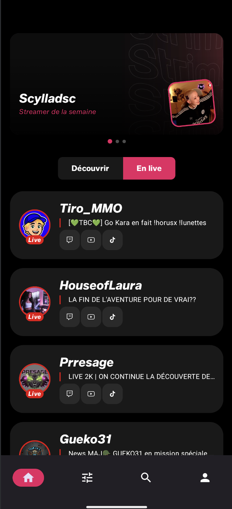
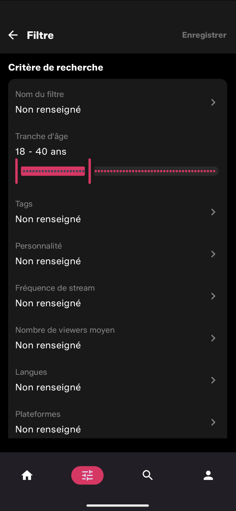
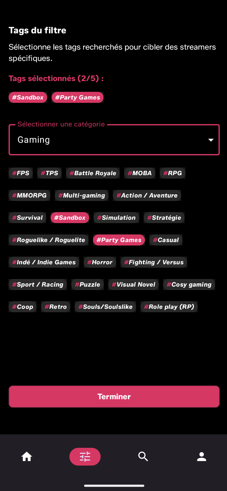

<p align="right">
  <a href="README.md"></a>
  <a href="README.en.md"></a>
</p>

# Strimup — Android Native

> **Discover and connect with content creators who match your interests.**
> The 100% native Kotlin/Compose port of the [strimup.com](https://www.strimup.com) web platform.

<p align="left">
  <a href="https://github.com/DylanMagalhaes/strimup-android/actions/workflows/ci.yml"></a>
  
  
  
  
  
  
  
  
  
  
  
  
</p>

---

## App preview

<p align="center">
  
  
  
</p>

## Table of Contents

- [About & Project Origin](#about)
- [Key Features](#features)
- [Architecture & Design Patterns](#architecture)
- [Tech Stack & Libraries](#tech-stack)
- [Security & Release Build](#security)
- [Testing](#testing)
- [Best Practices & Code Quality](#best-practices)
- [Project Structure](#structure)
- [Installation & Setup](#installation)
- [Roadmap](#roadmap)
- [Author](#author)

---

<a id="about"></a>
## About & Project Origin

**Strimup** is a platform connecting **streamers** and **communities**, designed to help content creators gain visibility and to let viewers discover new talent through a **multi-criteria filtering** system (category, language, platform, age range, tags, live status, etc.).

The project started out as a **full web application** ([www.strimup.com](https://www.strimup.com)) that I developed and deployed full-stack. Given the massive shift toward mobile usage, and my own desire to specialize in the **native Android** ecosystem, I undertook a **full port to Kotlin / Jetpack Compose**, reusing the same backend (REST API) but with an architecture rebuilt **from scratch** according to mobile industry standards.

This repository is therefore not a simple academic exercise: it is a **real production application**, backed by a live production backend and prepared for release on the **Google Play Store**. It has two goals:

1. Provide Strimup users with a smooth, fast mobile experience.
2. Demonstrate my ability to design a robust, testable, and maintainable Android application — clean architecture, strict separation of concerns, rigorous state management, security and release quality.

---
<a id="features"></a>
## Key Features

### Home & discovery
Editorial banner and discovery feeds (random / live), with **pull-to-refresh** and an **offline Room cache**: the banner and the first streamers stay available without a network connection (live information is never cached, so the app never shows a stale "live" badge).

### Advanced multi-criteria filters
Creation of custom search filters (category, language, platform, age range via an `AgeRangePicker`, tags…), saved and manageable from a dedicated list with **optimistic deletion** (immediate UI update, rollback on network failure).

### Streamer matching
Results screen (`MatchedStreamersScreen`) displaying streamers matching a filter, with **pagination**, a "live only" toggle, and real-time live status.

### Streamer page & favorites
Detailed profile (bio, social links, embedded YouTube videos), add to favorites with an **optimistic update** and rollback, searchable favorites list.

### Streamer profile & editing
Profile editing (avatar, bio, social networks, tags) through modular components (`BottomSheet`, tag pickers). The avatar is **resized, rotated according to EXIF and re-encoded as JPEG** before upload.

### Authentication
- E-mail sign-in / sign-up with per-field validation and backend error messages.
- **Twitch sign-in (OAuth 2 + PKCE)** through Custom Tabs and a deep link.
- Persisted session with **automatic token refresh** through an OkHttp `Authenticator`.

### Notifications
**Firebase Cloud Messaging push** (including when the app is closed), dedicated Android channels, Android 13+ permission request at the right moment, in-app notification center with an unread counter, and direct access to the system notification settings.

### Account & compliance
- **My account** screen: sign-out, notification status and settings, **account deletion** (with confirmation, and password depending on the account type).
- **Profile reporting** (reasons, details, "already reported" handling) for content moderation.
- Terms of service and privacy policy links built into sign-up.

---
<a id="architecture"></a>
## Architecture & Design Patterns

The application follows **Clean Architecture** principles, split into three independent layers per feature, promoting decoupling, testability, and scalability.

```
┌───────────────────────────────────────────────┐
│                 Presentation                  │
│   Composables · ViewModel · UiState · UiEvent │
└───────────────────────▲───────────────────────┘
                        │ exposes (StateFlow / Channel)
┌───────────────────────┴───────────────────────┐
│                     Domain                    │
│   UseCases · Entities · Repository (interface)│
└───────────────────────▲───────────────────────┘
                        │ implements
┌───────────────────────┴───────────────────────┐
│                     Data                      │
│ Repository (impl) · Retrofit API · Room · DTO │
└───────────────────────────────────────────────┘
```

- **`data/`** — Repository implementations, Retrofit services, Room DAOs, DTOs, and mappers (DTO → domain entity).
- **`domain/`** — Business core, independent of the Android framework: entities, repository interfaces, and **UseCases** (one responsibility per use case: `CreateFilterUseCase`, `GetStreamersByFilterUseCase`, `ReportStreamerUseCase`…). Each use case is a `fun interface` implemented by a `Default…` class, so tests can replace it with a plain lambda.
- **`presentation/`** — ViewModels, UI states, and Compose screens. No business logic flows through here: the ViewModel orchestrates UseCases and exposes immutable state.

The project lives in a single `app` module organized into **`core/`** (cross-cutting building blocks: network, database, security, user, streamer, favorites, tags, design system) and **`feature/`** (`auth`, `home`, `search`, `filter`, `favorite`, `streamerdetail`, `streamerprofile`, `notification`, `push`, `account`, `report`), each exposing its own Hilt module.

### MVVM / MVI & state management

- **Unidirectional state (UDF)**: the `ViewModel` holds a single private `MutableStateFlow<UiState>`, exposed read-only via `StateFlow`. The Compose UI only observes and renders that state — never the reverse.
- **States modeled as `sealed interface`**: each screen defines its own exhaustive state contract, letting the Kotlin compiler guarantee that no case (`Loading`, `Success`, `Error`) is missed in the Composable's `when`.

  ```kotlin
  sealed interface MatchedStreamersUiState {
      data object Loading : MatchedStreamersUiState

      data class Success(
          val filterName: String? = null,
          val matchedResult: StreamerMatchResult,
          val originalMatchedResult: StreamerMatchResult,
          val isLiveOnly: Boolean = false,
          val isLoadingNextPage: Boolean = false,
      ) : MatchedStreamersUiState

      data class Error(@StringRes val errorMessageRes: Int) : MatchedStreamersUiState
  }
  ```

- **One-off events (`UiEvent`)**: single-use effects (showing a `Snackbar`, navigating, opening a link) flow through a `Channel` exposed as a `Flow`, kept separate from persistent state — avoiding event replay on recomposition or configuration change.

  ```kotlin
  sealed interface ReportStreamerUiEvent {
      data class Reported(@StringRes val messageRes: Int) : ReportStreamerUiEvent
  }
  ```

### Dependency Injection — Hilt

Each `feature` and each `core` module exposes its own **Hilt module** (`@Module @InstallIn(SingletonComponent::class)`), binding `domain` interfaces to their `data` implementations (`FilterModule`, `HomeModule`, `AuthDomainModule`, `ReportDomainModule`, `StreamerCoreModule`…). `ViewModel`s are injected via `@HiltViewModel`.

### Typed error handling

No exception ever reaches the user raw: the `data` layer converts it into a closed business type, and only the `presentation` layer knows how to turn it into localized text.

```kotlin
// core/common — pure Kotlin, no Android dependency
sealed class DomainError {
    data object Network : DomainError()
    data object Timeout : DomainError()
    data object Unauthorized : DomainError()
    data class Server(val code: Int, val message: String? = null) : DomainError()
    data object Serialization : DomainError()
    data object Unknown : DomainError()
}

// core/network — Throwable → DomainError, applied at each repository's boundary
fun Throwable.toDomainError(): DomainError = when (this) {
    is DomainException -> error
    is SocketTimeoutException -> DomainError.Timeout
    is HttpException -> if (code() == 401) DomainError.Unauthorized else DomainError.Server(code(), apiErrorMessage())
    is SerializationException -> DomainError.Serialization
    is IOException -> DomainError.Network
    else -> DomainError.Unknown
}

// core/ui — the only layer aware of Android resources
fun DomainError.toUiText(): UiText {
    val serverMessage = (this as? DomainError.Server)?.takeIf { it.code in 400..499 }?.message
    return serverMessage?.let(UiText::Dynamic) ?: UiText.Resource(toMessageRes())
}
```

- 4xx errors display the business message returned by the backend ("You have already reported this profile."), other errors a generic localized message.
- A shared **`ErrorState`** Compose component (icon, title, message, *Retry* action) is reused on every failing screen.

---
<a id="tech-stack"></a>
## Tech Stack & Libraries

| Domain | Technologies |
|---|---|
| **UI** | [Jetpack Compose](https://developer.android.com/jetpack/compose) · Material 3 · [Navigation 3](https://developer.android.com/guide/navigation/navigation-3) · Coil 3 · Custom Tabs |
| **Async** | Kotlin Coroutines · `Flow` / `StateFlow` |
| **Networking** | Retrofit 2 · OkHttp (custom `Authenticator`/`Interceptor` for token refresh, network logs in debug only) · Kotlinx Serialization |
| **Persistence** | Room 3 (versioned, tested migrations) · DataStore Preferences |
| **Security** | Android Keystore (AES-GCM) for tokens · R8 |
| **Firebase** | Cloud Messaging (push) · Crashlytics (release only) |
| **Dependency Injection** | Hilt / Dagger |
| **Testing** | JUnit 4 · Truth · Turbine · kotlinx-coroutines-test · Room Testing |
| **Quality** | detekt (+ formatting) · Android Lint · GitHub Actions |
| **Build** | Gradle Kotlin DSL · Version Catalog (`libs.versions.toml`) · KSP |

---
<a id="security"></a>
## Security & Release Build

- **Encrypted tokens**: access and refresh tokens are encrypted with AES-GCM using an **Android Keystore** key before being written to DataStore, with transparent migration of legacy values.
- **No leaks in production**: network logs disabled in release (and sensitive data redacted in debug), `allowBackup="false"` with exclusion rules, cleartext HTTP traffic forbidden.
- **Minified, signed release**: R8 + resource shrinking, signing read from `keystore.properties` or environment variables (never committed).
- **Database**: exported Room schemas, explicit migrations covered by instrumented tests; destructive migration is only allowed in debug.
- **Observability**: Firebase Crashlytics in release, with automatic R8 mapping upload for readable stack traces.
- **Twitch OAuth** with **PKCE**: an intercepted code is not enough to open a session.

---
<a id="testing"></a>
## Testing

- **500+ unit tests** covering mappers, use cases, repositories, ViewModels and utilities (`./gradlew testDebugUnitTest`).
- **Fakes over mocks**: dependencies are `fun interface`s or repository interfaces, replaced in tests by lambdas or small in-memory classes.
- **Coroutines & Flow** tested with a `MainDispatcherRule`, `runTest` and **Turbine** for UI events.
- **Room instrumented tests**: schema migrations validated with `MigrationTestHelper` (`./gradlew connectedDebugAndroidTest`).

```kotlin
@Test
fun `a conflict should mean the profile was already reported`() = runTest {
    val repository = DefaultReportRepository(FakeReportApiService { throw httpException(409) })

    val result = repository.reportStreamer("42", ReportReason.SpamOrScam, null)

    assertThat(result.getOrNull()).isEqualTo(ReportOutcome.AlreadyReported)
}
```

---
<a id="best-practices"></a>
## Best Practices & Code Quality

- **State immutability**: `UiState`s are immutable `data class` / `sealed interface` types; every update goes through `copy()`.
- **End-to-end `Result<T>`**: `UseCase`s and `Repository`s return Kotlin `Result<T>`, enforcing explicit success/failure handling all the way to the ViewModel.
- **Interface-oriented repositories**: each feature exposes a `Repository` interface in `domain/`, implemented in `data/`.
- **Reusable Compose components**: `ErrorState`, `SocialIconButton`, `PasswordVisibilityToggle`, `ReportStreamerSheet`… with **`@Preview`**.
- **Internationalization**: no hardcoded UI strings, `strings.xml` with **plurals**, and `UiText` to carry localizable text out of the ViewModel.
- **Accessibility**: meaningful `contentDescription`s on interactive elements, `null` on decorative ones, semantic roles (`Role.RadioButton`) on choice lists.
- **Strict layer separation**: no Android dependency (`Context`, views) in `domain/`.
- **Continuous static analysis**: `detekt` (custom config + baseline) and Android Lint run on every push/PR via **GitHub Actions**, alongside the build and test suite; `main` is protected (PR + green CI required).

---
<a id="structure"></a>
## Project Structure

```
app/src/main/java/com/strimup/
├── core/                      # Shared cross-cutting building blocks
│   ├── common/                 # DomainError, DomainException (pure Kotlin)
│   ├── database/               # Room: database, migrations, converters
│   ├── network/                # Retrofit / OkHttp, error mapping
│   ├── security/               # Android Keystore encryption
│   ├── user/                   # Signed-in user
│   ├── streamer/               # Streamer domain (entities, repository, avatar)
│   ├── favorite/               # Favorites (Room + API)
│   ├── tag/                    # Tags & categories
│   ├── navigation/             # Navigation 3 destinations
│   └── ui/                     # Design system, components, UiText, errors
│
└── feature/                   # Screens & business logic per feature
    ├── auth/                   # Sign-in, sign-up, Twitch OAuth
    ├── home/                   # Home, banner, offline cache
    ├── search/                 # Streamer search
    ├── filter/                 # Filter creation, list & matching
    ├── favorite/               # Favorites list
    ├── streamerdetail/         # Streamer page
    ├── streamerprofile/        # Signed-in streamer profile & editing
    ├── notification/           # Notification center & settings
    ├── push/                   # Firebase Cloud Messaging
    ├── account/                # My account, account deletion
    └── report/                 # Profile reporting

# Each feature follows the same split: data/ · domain/ · presentation/ · injection/
```

---
<a id="installation"></a>
## Installation & Setup

### Prerequisites

- [Android Studio](https://developer.android.com/studio) (latest stable version)
- JDK 17+
- A device / emulator running **API 27 (Android 8.1)** or higher

### Run in debug

```bash
git clone https://github.com/DylanMagalhaes/strimup-android.git
cd strimup-android
./gradlew installDebug
```

The project uses a **Version Catalog** (`gradle/libs.versions.toml`): Gradle resolves every dependency on sync. The app talks to Strimup's production REST API; no API key is required. In debug only, the URL can be overridden with `BASE_URL` in `local.properties`.

### Check like the CI

```bash
./gradlew assembleDebug lintDebug testDebugUnitTest detekt
```

### Release build

Copy `keystore.properties.example` to `keystore.properties` (ignored by Git) and fill in the keystore, or set the `STRIMUP_RELEASE_*` environment variables, then:

```bash
./gradlew bundleRelease
```

---
<a id="roadmap"></a>
## Roadmap

- [x] Typed error handling (`DomainError`) & localized messages
- [x] 500+ unit tests (mappers, use cases, repositories, ViewModels)
- [x] CI (build, lint, tests, detekt via GitHub Actions) & `main` branch protection
- [x] Signed, minified release build, encrypted tokens, tested Room migrations
- [x] All UI strings externalized, plurals & accessibility
- [x] Push notifications, offline home cache, pull-to-refresh
- [x] Account deletion, profile reporting, Crashlytics
- [ ] Google Play Store release (closed testing)
- [ ] Room DAO instrumented tests & Compose UI tests
- [ ] Coverage report (Kover) & badge
- [ ] Global "offline" banner
- [ ] Multi-module Gradle modularization (`:core:*`, `:feature:*`)

Detailed tracking lives in [`docs/ROADMAP.md`](docs/ROADMAP.md) (French).

---
<a id="author"></a>
## Author

**Dylan Magalhaes** — Full-Stack Developer (Web & Native Android)
Developer of the [strimup.com](https://www.strimup.com) platform.

---
