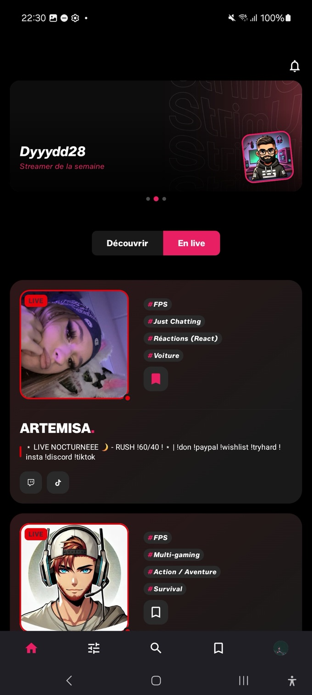
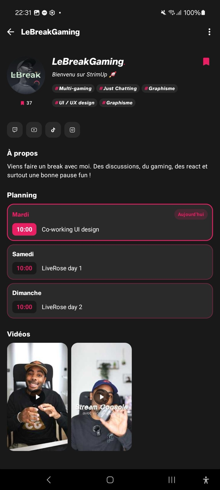
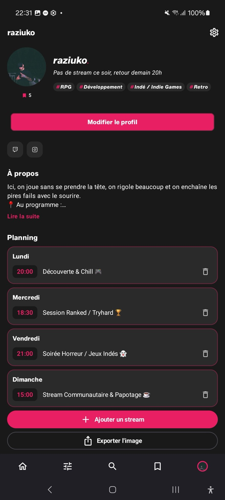
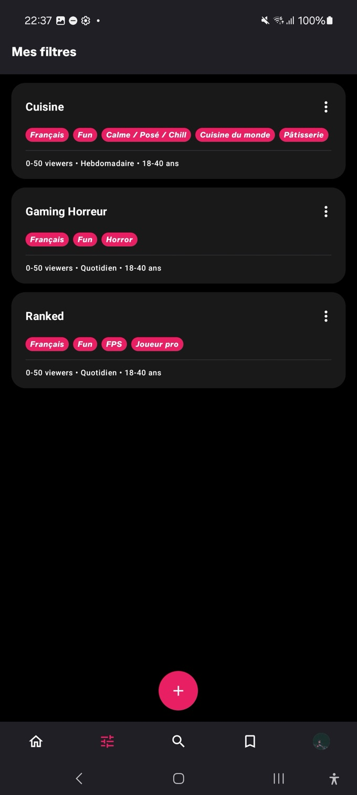
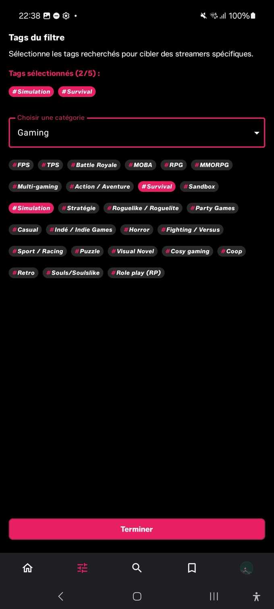
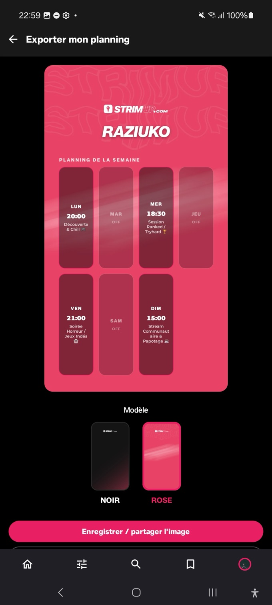

<p align="right">
  <a href="README.md"></a>
  <a href="README.en.md"></a>
</p>

# Strimup — Android Native

> **Découvrez et connectez-vous avec les créateurs de contenu qui vous correspondent.**
> Le portage 100% natif Kotlin/Compose de la plateforme web [strimup.com](https://www.strimup.com).

<p align="left">
  <a href="https://github.com/DylanMagalhaes/strimup-android/actions/workflows/ci.yml"></a>
  
  
  
  
  
  
  
  
  
  
  
  
</p>

---

## Aperçu de l'application

<p align="center">
  
  
  
</p>
<p align="center">
  
  
  
</p>

## Sommaire

- [À propos & Genèse du projet](#a-propos)
- [Fonctionnalités clés](#fonctionnalites)
- [Architecture & Design Patterns](#architecture)
- [Stack technique & bibliothèques](#stack-technique)
- [Sécurité & build release](#securite)
- [Tests](#tests)
- [Bonnes pratiques & Code Quality](#bonnes-pratiques)
- [Structure du projet](#structure)
- [Installation & Configuration](#installation)
- [Roadmap](#roadmap)
- [Auteur](#auteur)

---

<a id="a-propos"></a>
## À propos & Genèse du projet

**Strimup** est une plateforme de mise en relation entre **streamers** et **communautés**, pensée pour aider les créateurs de contenu à gagner en visibilité et permettre aux viewers de découvrir de nouveaux talents grâce à un système de **filtres multicritères** (catégorie, langue, plateforme, tranche d'âge, tags, statut live, etc.).

Le projet est né sous la forme d'une **application web complète** ([www.strimup.com](https://www.strimup.com)) que j'ai développée et déployée en full-stack. Face à l'usage massif du mobile et à mon envie de me spécialiser sur l'écosystème **Android natif**, j'ai entrepris un **portage complet en Kotlin / Jetpack Compose**, en repartant du même backend (API REST) mais avec une architecture pensée **from scratch** selon les standards de l'industrie mobile.

Ce dépôt n'est donc pas un simple exercice académique : c'est une **application produit réelle**, avec un backend en production, préparée pour une publication sur le **Google Play Store**. L'objectif est double :

1. Offrir une expérience mobile fluide et rapide aux utilisateurs de Strimup.
2. Démontrer ma capacité à concevoir une application Android robuste, testable et maintenable — architecture propre, séparation des responsabilités, gestion d'état stricte, sécurité et qualité de release.

---
<a id="fonctionnalites"></a>
## Fonctionnalités clés

### Accueil & découverte
Bannière éditoriale et fils de découverte (au hasard / en live), avec **pull-to-refresh** et **cache hors-ligne Room** : la bannière et les premiers streamers restent consultables sans réseau (les informations live ne sont jamais mises en cache, pour ne jamais afficher un faux « en live »).

### Filtres multicritères avancés
Création de filtres de recherche personnalisés (catégorie, langue, plateforme, tranche d'âge via un `AgeRangePicker`, tags…), sauvegardés et gérables depuis une liste dédiée avec **suppression optimiste** (mise à jour immédiate de l'UI, rollback en cas d'échec réseau).

### Matching de streamers
Écran de résultats (`MatchedStreamersScreen`) affichant les streamers correspondant à un filtre, avec **pagination**, bascule « en live uniquement » et statut live en temps réel.

### Fiche streamer & favoris
Profil détaillé (bio, réseaux sociaux, vidéos YouTube intégrées), ajout aux favoris avec **mise à jour optimiste** et rollback, liste de favoris avec recherche.

### Profil streamer & édition
Édition du profil (avatar, bio, réseaux sociaux, tags) via des composants modulaires (`BottomSheet`, sélecteurs de tags). L'avatar est **redimensionné, réorienté (EXIF) et ré-encodé en JPEG** avant l'envoi.

### Authentification
- Connexion / inscription par email avec validation champ par champ et messages d'erreur du backend.
- **Connexion Twitch (OAuth 2 + PKCE)** via Custom Tabs et deep link.
- Session persistée, **refresh automatique du token** via un `Authenticator` OkHttp.

### Notifications
**Push Firebase Cloud Messaging** (y compris application fermée), canaux Android dédiés, demande de permission Android 13+ au bon moment, centre de notifications in-app avec compteur de non-lus, et accès direct aux réglages de notifications du système.

### Compte & conformité
- Écran **Mon compte** : déconnexion, état et réglages des notifications, **suppression de compte** (avec confirmation et mot de passe selon le type de compte).
- **Signalement de profil** (motifs, détails, gestion du « déjà signalé ») pour la modération des contenus.
- Liens CGU et politique de confidentialité intégrés à l'inscription.

---
<a id="architecture"></a>
## Architecture & Design Patterns

L'application suit les principes de la **Clean Architecture**, découpée en trois couches indépendantes par feature, favorisant le découplage, la testabilité et l'évolutivité.

```
┌───────────────────────────────────────────────┐
│                 Presentation                  │
│   Composables · ViewModel · UiState · UiEvent │
└───────────────────────▲───────────────────────┘
                        │ expose (StateFlow / Channel)
┌───────────────────────┴───────────────────────┐
│                     Domain                    │
│   UseCases · Entities · Repository (interface)│
└───────────────────────▲───────────────────────┘
                        │ implémente
┌───────────────────────┴───────────────────────┐
│                     Data                      │
│ Repository (impl) · Retrofit API · Room · DTO │
└───────────────────────────────────────────────┘
```

- **`data/`** — Implémentations des repositories, services Retrofit, DAO Room, DTO et mappers (DTO → entité de domaine).
- **`domain/`** — Cœur métier, indépendant du framework Android : entités, interfaces de repository et **UseCases** (une responsabilité par cas d'usage : `CreateFilterUseCase`, `GetStreamersByFilterUseCase`, `ReportStreamerUseCase`…). Chaque use case est une `fun interface` implémentée par une classe `Default…`, ce qui permet de la remplacer par une simple lambda dans les tests.
- **`presentation/`** — ViewModels, états d'UI et écrans Compose. Aucune logique métier n'y transite : le ViewModel orchestre les UseCases et expose un état immuable.

Le projet est organisé au sein d'un module `app` unique en **`core/`** (briques transverses : réseau, base de données, sécurité, utilisateur, streamer, favoris, tags, design system) et **`feature/`** (`auth`, `home`, `search`, `filter`, `favorite`, `streamerdetail`, `streamerprofile`, `notification`, `push`, `account`, `report`), chacun exposant son propre module Hilt.

### MVVM / MVI & gestion d'état

- **State unidirectionnel (UDF)** : le `ViewModel` détient un unique `MutableStateFlow<UiState>` privé, exposé en lecture seule via `StateFlow`. La UI Compose ne fait qu'observer et rendre cet état — jamais l'inverse.
- **États modélisés en `sealed interface`** : chaque écran définit son propre contrat d'état exhaustif, ce qui permet au compilateur Kotlin de garantir qu'aucun cas (`Loading`, `Success`, `Error`) n'est oublié dans le `when` du Composable.

  ```kotlin
  sealed interface MatchedStreamersUiState {
      data object Loading : MatchedStreamersUiState

      data class Success(
          val filterName: String? = null,
          val matchedResult: StreamerMatchResult,
          val originalMatchedResult: StreamerMatchResult,
          val isLiveOnly: Boolean = false,
          val isLoadingNextPage: Boolean = false,
      ) : MatchedStreamersUiState

      data class Error(@StringRes val errorMessageRes: Int) : MatchedStreamersUiState
  }
  ```

- **Événements ponctuels (`UiEvent`)** : les effets à usage unique (afficher un `Snackbar`, naviguer, ouvrir un lien) transitent via un `Channel` exposé en `Flow`, séparé de l'état persistant — évitant le rejeu d'événements lors d'une recomposition ou d'un changement de configuration.

  ```kotlin
  sealed interface ReportStreamerUiEvent {
      data class Reported(@StringRes val messageRes: Int) : ReportStreamerUiEvent
  }
  ```

### Injection de dépendances — Hilt

Chaque `feature` et chaque module `core` expose son propre **module Hilt** (`@Module @InstallIn(SingletonComponent::class)`), liant les interfaces de `domain` à leurs implémentations `data` (`FilterModule`, `HomeModule`, `AuthDomainModule`, `ReportDomainModule`, `StreamerCoreModule`…). Les `ViewModel` sont injectés via `@HiltViewModel`.

### Gestion d'erreurs typée

Aucune exception ne remonte brute jusqu'à l'utilisateur : la couche `data` la convertit en un type métier fermé, et seule la couche `presentation` sait le traduire en texte localisé.

```kotlin
// core/common — pur Kotlin, aucune dépendance Android
sealed class DomainError {
    data object Network : DomainError()
    data object Timeout : DomainError()
    data object Unauthorized : DomainError()
    data class Server(val code: Int, val message: String? = null) : DomainError()
    data object Serialization : DomainError()
    data object Unknown : DomainError()
}

// core/network — Throwable → DomainError, appliqué au bord de chaque repository
fun Throwable.toDomainError(): DomainError = when (this) {
    is DomainException -> error
    is SocketTimeoutException -> DomainError.Timeout
    is HttpException -> if (code() == 401) DomainError.Unauthorized else DomainError.Server(code(), apiErrorMessage())
    is SerializationException -> DomainError.Serialization
    is IOException -> DomainError.Network
    else -> DomainError.Unknown
}

// core/ui — seule couche qui connaît les ressources Android
fun DomainError.toUiText(): UiText {
    val serverMessage = (this as? DomainError.Server)?.takeIf { it.code in 400..499 }?.message
    return serverMessage?.let(UiText::Dynamic) ?: UiText.Resource(toMessageRes())
}
```

- Les erreurs 4xx affichent le message métier renvoyé par le backend (« Tu as déjà signalé ce profil. »), les autres un message localisé générique.
- Un composant Compose partagé **`ErrorState`** (icône, titre, message, action *Réessayer*) est réutilisé sur tous les écrans en échec.

---
<a id="stack-technique"></a>
## Stack technique & bibliothèques

| Domaine | Technologies |
|---|---|
| **UI** | [Jetpack Compose](https://developer.android.com/jetpack/compose) · Material 3 · [Navigation 3](https://developer.android.com/guide/navigation/navigation-3) · Coil 3 · Custom Tabs |
| **Asynchronisme** | Kotlin Coroutines · `Flow` / `StateFlow` |
| **Réseau** | Retrofit 2 · OkHttp (`Authenticator`/`Interceptor` custom pour le refresh de token, logs réseau en debug uniquement) · Kotlinx Serialization |
| **Persistance** | Room 3 (migrations versionnées et testées) · DataStore Preferences |
| **Sécurité** | Android Keystore (AES-GCM) pour les tokens · R8 |
| **Firebase** | Cloud Messaging (push) · Crashlytics (release uniquement) |
| **Injection de dépendances** | Hilt / Dagger |
| **Tests** | JUnit 4 · Truth · Turbine · kotlinx-coroutines-test · Room Testing |
| **Qualité** | detekt (+ formatting) · Android Lint · GitHub Actions |
| **Build** | Gradle Kotlin DSL · Version Catalog (`libs.versions.toml`) · KSP |

---
<a id="securite"></a>
## Sécurité & build release

- **Tokens chiffrés** : access et refresh tokens chiffrés en AES-GCM avec une clé de l'**Android Keystore** avant d'être écrits dans DataStore, avec migration transparente des anciennes valeurs.
- **Aucune fuite en production** : logs réseau coupés en release (et données sensibles masquées en debug), `allowBackup="false"` avec règles d'exclusion, trafic HTTP non chiffré interdit.
- **Release minifiée et signée** : R8 + réduction des ressources, signature lue depuis `keystore.properties` ou des variables d'environnement (jamais commitée).
- **Base de données** : schémas Room exportés, migrations explicites testées en instrumenté ; la migration destructive n'est autorisée qu'en debug.
- **Observabilité** : Firebase Crashlytics en release, avec envoi automatique du mapping R8 pour des stack traces lisibles.
- **OAuth Twitch** avec **PKCE** : un code intercepté ne suffit pas à ouvrir une session.

---
<a id="tests"></a>
## Tests

- **500+ tests unitaires** couvrant mappers, use cases, repositories, ViewModels et utilitaires (`./gradlew testDebugUnitTest`).
- **Fakes plutôt que mocks** : les dépendances sont des `fun interface` ou des interfaces de repository, remplacées dans les tests par des lambdas ou de petites classes en mémoire.
- **Coroutines & Flow** testés avec `MainDispatcherRule`, `runTest` et **Turbine** pour les événements UI.
- **Tests instrumentés Room** : validation des migrations de schéma avec `MigrationTestHelper` (`./gradlew connectedDebugAndroidTest`).

```kotlin
@Test
fun `a conflict should mean the profile was already reported`() = runTest {
    val repository = DefaultReportRepository(FakeReportApiService { throw httpException(409) })

    val result = repository.reportStreamer("42", ReportReason.SpamOrScam, null)

    assertThat(result.getOrNull()).isEqualTo(ReportOutcome.AlreadyReported)
}
```

---
<a id="bonnes-pratiques"></a>
## Bonnes pratiques & Code Quality

- **Immuabilité du state** : les `UiState` sont des `data class` / `sealed interface` immuables ; toute mise à jour passe par `copy()`.
- **`Result<T>` de bout en bout** : les `UseCase` et `Repository` retournent des `Result<T>`, forçant une gestion explicite du succès et de l'échec jusque dans le ViewModel.
- **Repositories orientés interface** : chaque feature expose une interface de `Repository` dans `domain/`, implémentée dans `data/`.
- **Composants Compose réutilisables** : `ErrorState`, `SocialIconButton`, `PasswordVisibilityToggle`, `ReportStreamerSheet`… avec **`@Preview`**.
- **Internationalisation** : aucune chaîne en dur dans l'UI, `strings.xml` avec **plurals** et `UiText` pour transporter un texte localisable depuis le ViewModel.
- **Accessibilité** : `contentDescription` réels sur les éléments interactifs, `null` sur le décoratif, rôles sémantiques (`Role.RadioButton`) sur les listes de choix.
- **Séparation stricte des couches** : aucune dépendance Android (`Context`, vues) dans `domain/`.
- **Analyse statique en continu** : `detekt` (config personnalisée + baseline) et Android Lint exécutés à chaque push/PR via **GitHub Actions**, aux côtés du build et de la suite de tests ; `main` est protégée (PR + CI verte obligatoires).

---
<a id="structure"></a>
## Structure du projet

```
app/src/main/java/com/strimup/
├── core/                      # Briques transverses partagées
│   ├── common/                 # DomainError, DomainException (pur Kotlin)
│   ├── database/               # Room : base, migrations, converters
│   ├── network/                # Retrofit / OkHttp, mapping des erreurs
│   ├── security/               # Chiffrement Android Keystore
│   ├── user/                   # Utilisateur connecté
│   ├── streamer/               # Domaine streamer (entités, repository, avatar)
│   ├── favorite/               # Favoris (Room + API)
│   ├── tag/                    # Tags & catégories
│   ├── navigation/             # Destinations Navigation 3
│   └── ui/                     # Design system, composants, UiText, erreurs
│
└── feature/                   # Écrans & logique métier par fonctionnalité
    ├── auth/                   # Connexion, inscription, OAuth Twitch
    ├── home/                   # Accueil, bannière, cache hors-ligne
    ├── search/                 # Recherche de streamers
    ├── filter/                 # Création, liste & matching de filtres
    ├── favorite/               # Liste des favoris
    ├── streamerdetail/         # Fiche d'un streamer
    ├── streamerprofile/        # Profil du streamer connecté & édition
    ├── notification/           # Centre de notifications & réglages
    ├── push/                   # Firebase Cloud Messaging
    ├── account/                # Mon compte, suppression de compte
    └── report/                 # Signalement de profil

# Chaque feature suit le découpage : data/ · domain/ · presentation/ · injection/
```

---
<a id="installation"></a>
## Installation & Configuration

### Prérequis

- [Android Studio](https://developer.android.com/studio) (dernière version stable)
- JDK 17+
- Un appareil / émulateur avec **API 27 (Android 8.1)** minimum

### Lancer en debug

```bash
git clone https://github.com/DylanMagalhaes/strimup-android.git
cd strimup-android
./gradlew installDebug
```

Le projet utilise un **Version Catalog** (`gradle/libs.versions.toml`) : Gradle résout toutes les dépendances à la synchronisation. L'application communique avec l'API REST de production Strimup ; aucune clé API n'est requise. En debug uniquement, l'URL peut être surchargée avec `BASE_URL` dans `local.properties`.

### Vérifier comme la CI

```bash
./gradlew assembleDebug lintDebug testDebugUnitTest detekt
```

### Build release

Copier `keystore.properties.example` en `keystore.properties` (ignoré par Git) et y renseigner le keystore, ou définir les variables d'environnement `STRIMUP_RELEASE_*`, puis :

```bash
./gradlew bundleRelease
```

---
<a id="roadmap"></a>
## Roadmap

- [x] Gestion d'erreurs typée (`DomainError`) & messages localisés
- [x] 500+ tests unitaires (mappers, use cases, repositories, ViewModels)
- [x] CI (build, lint, tests, detekt via GitHub Actions) & protection de `main`
- [x] Build release signé, minifié, tokens chiffrés, migrations Room testées
- [x] Externalisation complète des chaînes, plurals & accessibilité
- [x] Notifications push, cache hors-ligne de l'accueil, pull-to-refresh
- [x] Suppression de compte, signalement de profil, Crashlytics
- [ ] Publication sur le Google Play Store (test fermé)
- [ ] Tests instrumentés DAO Room & tests UI Compose
- [ ] Rapport de couverture (Kover) & badge
- [ ] Bandeau « hors ligne » global
- [ ] Modularisation Gradle multi-module (`:core:*`, `:feature:*`)

Le détail est suivi dans [`docs/ROADMAP.md`](docs/ROADMAP.md).

---
<a id="auteur"></a>
## Auteur

**Dylan Magalhaes** — Développeur Full-Stack (Web & Android Natif)
Développeur de la plateforme [strimup.com](https://www.strimup.com).

---
